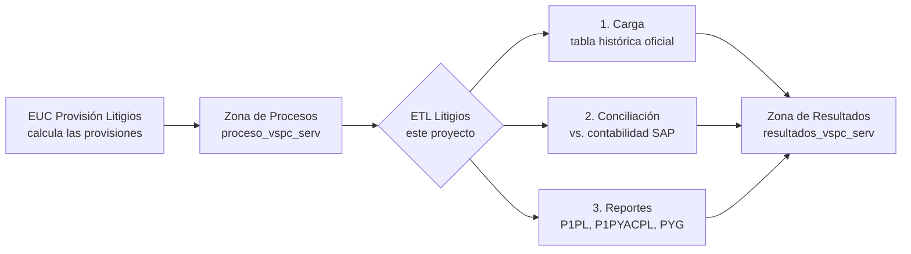
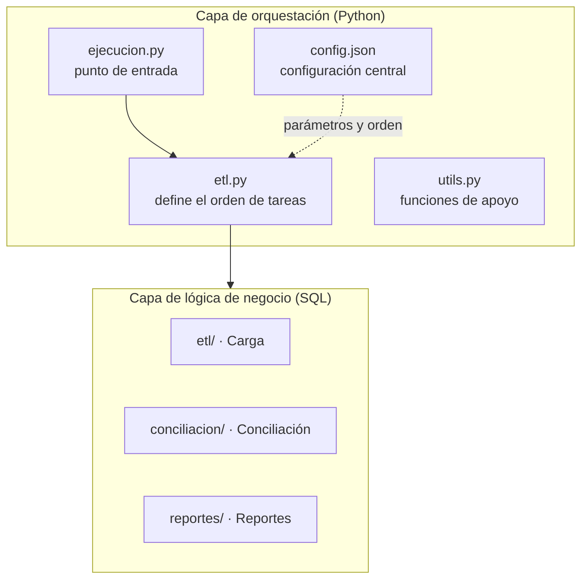
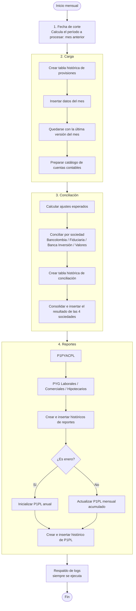

# Documentación Técnica — ETL Litigios (`vope-cdeo-reflitig`)

> **Proceso de negocio:** T080153 – Calcular y Provisionar Litigios Comerciales, Hipotecarios y Laborales
> **Tipo de documento:** Documentación técnica y funcional del proceso

---

## Tabla de contenido

1. [Introducción](#1-introducción)
2. [Resumen ejecutivo](#2-resumen-ejecutivo)
3. [Objetivos](#3-objetivos)
4. [Arquitectura del proceso](#4-arquitectura-del-proceso)
5. [Tablas de entrada (insumos)](#5-tablas-de-entrada-insumos)
6. [Tablas de salida (resultados)](#6-tablas-de-salida-resultados)
7. [Estructura del proyecto y archivos generales](#7-estructura-del-proyecto-y-archivos-generales)
8. [Detalle de la lógica SQL por etapa](#8-detalle-de-la-lógica-sql-por-etapa)
9. [Manejo de logs y errores](#9-manejo-de-logs-y-errores)
10. [Proceso de ejecución (etapas del flujo)](#10-proceso-de-ejecución-etapas-del-flujo)
11. [Glosario](#11-glosario)

---

## 1. Introducción

Este documento describe, de forma clara y completa, el funcionamiento del proceso **ETL Litigios** (`vope-cdeo-reflitig`). El objetivo es que cualquier persona —técnica o no— pueda entender **qué hace el proceso, con qué información trabaja, cómo la transforma y qué resultados entrega**, sin necesidad de leer directamente el código fuente.

El proceso se ejecuta **una vez al mes** y se encarga de tomar el cálculo de provisiones de demandas (litigios) contra el banco, ya elaborado por una herramienta de cálculo del área usuaria, y a partir de ese cálculo:

- Consolidarlo en tablas históricas oficiales.
- Compararlo contra la contabilidad real del banco.
- Generar los reportes finales que consumen las áreas interesadas.

---

## 2. Resumen ejecutivo

La **ETL Litigios** automatiza el procesamiento mensual de la información de provisiones de demandas (litigios) **Comerciales, Hipotecarios y Laborales** contra el banco.

El insumo principal proviene de la **EUC Provisión Litigios**, una herramienta de cálculo (tipo Excel/macros) manejada por el área usuaria, que determina cuánto debe provisionar el banco por cada proceso legal en curso. La ETL **no calcula las provisiones**; su función es:

1. **Cargar** ese cálculo en tablas históricas y trazables dentro de la plataforma de datos del banco.
2. **Conciliar** el resultado contra los movimientos contables reales registrados en SAP, verificando que ambos coincidan.
3. **Generar reportes** consolidados y acumulados que se entregan a las áreas contables y de riesgo del banco.

En una frase: **la ETL mueve, valida y reporta la información de provisiones de litigios, dejando toda la trazabilidad necesaria mes a mes.**



---

## 3. Objetivos

**Objetivo general**

Automatizar la consolidación, validación y reporte mensual de la información de provisiones de litigios comerciales, hipotecarios y laborales del banco.

**Objetivos específicos**

- Cargar de forma histórica y trazable el cálculo mensual de provisiones entregado por la EUC.
- Garantizar que exista una única versión válida de los datos de cada mes, evitando duplicidades por reprocesos.
- Conciliar el valor calculado de las provisiones contra los movimientos contables reales registrados en SAP, para las cuatro sociedades del grupo (Bancolombia, Fiduciaria, Banca de Inversión y Valores).
- Generar los reportes mensuales (P1PYACPL, PYG por tipo de litigio y P1PL acumulado) que consumen las áreas contables.
- Dejar evidencia (logs) de cada ejecución, exitosa o fallida, para su seguimiento y soporte.

---

## 4. Arquitectura del proceso

### 4.1. Componentes principales

| Componente | Descripción |
|---|---|
| **EUC Provisión Litigios** | Herramienta externa (fuera de este proyecto) que calcula el valor de las provisiones de cada litigio y deja el resultado en la zona de procesos. |
| **Zona de Procesos** (`proceso_vspc_serv`) | Base de datos intermedia donde se realizan cálculos temporales y se recibe el insumo de la EUC. |
| **Zona de Resultados** (`resultados_vspc_serv`) | Base de datos final donde quedan las tablas históricas oficiales: el detalle de provisiones, la conciliación y los reportes. |
| **Motor de consulta (Impala)** | Motor que ejecuta las consultas SQL sobre la plataforma de datos en la nube (formato Parquet). |
| **Orquestador2** | Librería interna del banco que coordina la ejecución de los pasos del proceso, en el orden definido, y administra logs y manejo de errores. |
| **ETL Litigios** (este proyecto) | Paquete de Python que define, mediante el orquestador, la secuencia de tareas SQL que se deben ejecutar cada mes. |

### 4.2. Cómo está construido el proyecto

El proyecto es un **paquete de Python** que se apoya en librerías internas del banco. La lógica de negocio (los cálculos y transformaciones) está escrita **en su totalidad en archivos SQL**; el código Python únicamente decide **el orden** en que se ejecutan esos archivos y les inyecta los parámetros necesarios (fechas, nombres de tablas, etc.).



### 4.3. Convención de nombres de tablas

Los nombres de las tablas usados en los SQL están **parametrizados** entre llaves (`{...}`). Al ejecutarse, esas llaves se reemplazan por los valores definidos en `config.json`. Por ejemplo:

`{zona_r}.{indice}_{tabla}_hist` → se convierte en → `resultados_vspc_serv.litig_provision_hist`

| Parámetro | Valor |
|---|---|
| `{indice}` | `litig` |
| `{zona_p}` (zona de procesos) | `proceso_vspc_serv` |
| `{zona_r}` (zona de resultados) | `resultados_vspc_serv` |
| `{tabla}` | `provision` |
| `{tabla_param}` | `parametros_cuentas` |

Esto significa que **ningún nombre de tabla está escrito directamente en la lógica**: todos provienen de un único archivo de configuración, lo que facilita su mantenimiento y control de cambios.

---

## 5. Tablas de entrada (insumos)

El proceso recibe la información que necesita procesar cada mes desde tablas que ya se encuentran cargadas en la plataforma de datos del banco. Estas son las tablas que la ETL **lee** como punto de partida:

| Nombre de Insumo | Descripción / contenido | Ubicación / origen |
|---|---|---|
| `litig_provision_hist` | Historial con el detalle del cálculo de los litigios realizado por la EUC Provisión Litigios (cuantías, provisiones, calificación del proceso, fechas, cuentas contables asociadas y ajustes calculados). | `resultados_vspc_serv` |
| `litig_parametros_cuentas_hist` | Dato maestro con las cuentas contables afectadas en el proceso, según el tipo de litigio y el tipo de ajuste (8 cuentas por litigio). | `resultados_vspc_serv` |
| `fcr_sap_saldos_diarios_banco` | Saldos contables diarios registrados en SAP para la sociedad Bancolombia, usados como fuente oficial para la conciliación. | `resultados_fcr` |
| `Fcr_sap_saldos_diarios_fiduc` | Saldos contables diarios registrados en SAP para la sociedad Fiduciaria, usados como fuente oficial para la conciliación. | `resultados_fcr` |
| `fcr_sap_saldos_diarios_banin` | Saldos contables diarios registrados en SAP para la sociedad Banca de Inversión, usados como fuente oficial para la conciliación. | `resultados_fcr` |
| `fcr_sap_saldos_diarios_valor` | Saldos contables diarios registrados en SAP para la sociedad Valores, usados como fuente oficial para la conciliación. | `resultados_fcr` |
| `litig_p1pl_hist` (corte del mes anterior) | Reporte P1PL acumulado del mes anterior, usado como saldo inicial para construir el reporte P1PL del mes en curso. | `resultados_vspc_serv` |

Sin el insumo de la EUC (`litig_provision_hist`), el proceso no tiene información para procesar en el mes.

### Tablas intermedias generadas durante el proceso

Además de los insumos anteriores, el proceso crea y recrea, en cada ejecución, tablas de apoyo dentro de la zona de procesos:

| Tabla | Para qué sirve |
|---|---|
| `litig_last_provision` | Contiene únicamente la información más reciente (última ingestión) de las provisiones del mes que se está procesando, evitando trabajar con datos duplicados por reprocesos. |
| `litig_indices` | Tabla auxiliar con los valores del 1 al 8, usada para "desenrollar" las 8 cuentas contables de cada litigio en filas individuales. |
| `litig_last_cuentas` | Catálogo depurado de las cuentas contables vigentes, en formato de una cuenta por fila, listo para cruzar contra los saldos de SAP. |
| `litig_ajustes` | Valor de ajuste esperado por cada litigio, sociedad y cuenta contable, calculado a partir de las provisiones del mes (es el valor "teórico" contra el que se compara la contabilidad real). |
| `litig_conciliacion_bancolombia` / `_fiduciaria` / `_banca_inversion` / `_valores` | Resultado de comparar, para cada sociedad, el ajuste esperado contra el movimiento contable real de SAP. |

---

## 6. Tablas de salida (resultados)

Al terminar la ejecución mensual, quedan actualizadas las siguientes tablas históricas, cada una particionada por fecha de ingestión (año, mes y día). Estas son las tablas que otras áreas del banco **consultan** como resultado oficial del proceso:

| Nombre de Output | Descripción / contenido | Ubicación / origen |
|---|---|---|
| `litig_conciliacion_hist` | Conciliación entre los resultados de la EUC Provisión Litigios y la contabilidad registrada en SAP. | `resultados_vspc_serv` |
| `litig_p1pl_hist` | Reporte P1PL (acumulado mensual de provisión de litigios). | `resultados_vspc_serv` |
| `litig_p1pyacpl_hist` | Reporte P1PYACPL (cuantía actual acumulada de los procesos vigentes). | `resultados_vspc_serv` |
| `litig_pyg_comerciales_hist` | Reporte PYG comerciales (efecto contable débito/crédito de los litigios comerciales). | `resultados_vspc_serv` |
| `litig_pyg_laborales_hist` | Reporte PYG laborales (efecto contable débito/crédito de los litigios laborales). | `resultados_vspc_serv` |
| `litig_pyg_hipotecarios_hist` | Reporte PYG hipotecarios (efecto contable débito/crédito de los litigios hipotecarios). | `resultados_vspc_serv` |

Estas tablas son la fuente oficial que consultan las áreas contables y de riesgo del banco para su análisis mensual, y quedan disponibles de forma histórica para consultas de periodos anteriores.

---

## 7. Estructura del proyecto y archivos generales

```
vope-cdeo-reflitig/
├── README.md                  → Descripción funcional del proceso
├── setup.py / setup.cfg       → Definición del paquete Python y sus dependencias
├── versioneer.py              → Manejo automático de versiones a partir de Git
├── MANIFEST.in                → Define qué archivos adicionales se empaquetan (SQL, JSON, Excel)
├── docs/                      → Diagramas e imágenes de referencia
├── logs_calendarizacion/      → Carpeta donde se guardan los logs de cada ejecución
└── src/vope_cdeo_reflitig/
    ├── __init__.py             → Marca la carpeta como paquete de Python
    ├── _version.py             → Versión del paquete, generada automáticamente
    ├── ejecucion.py            → Punto de entrada: arranca todo el proceso
    ├── etl.py                  → Define el orden de las etapas y su lógica de control
    ├── utils.py                → Funciones de apoyo (argumentos de consola, logs, carga de Excel)
    └── static/
        ├── config.json         → Configuración central: nombres de tablas, zonas, orden de ejecución
        └── sql/
            ├── etl/            → SQL de la Etapa 1: Carga
            ├── conciliacion/   → SQL de la Etapa 2: Conciliación
            └── reportes/       → SQL de la Etapa 3: Reportes
```

### 6.1. Archivos de configuración y empaquetado (explicación general)

| Archivo | Para qué sirve |
|---|---|
| **`setup.py` / `setup.cfg`** | Son los archivos estándar de Python que describen el proyecto como un paquete instalable: su nombre (`vope-cdeo-reflitig`), autor, dependencias necesarias (`orquestador2`, `vspc-config-utils`, `vspc-respaldo-logs`, `master-validation`) y la versión mínima de Python requerida. Gracias a esto, el proceso se puede instalar como cualquier librería y ejecutarse de forma calendarizada. |
| **`versioneer.py`** | Herramienta que calcula automáticamente el número de versión del paquete a partir del historial de Git (por ejemplo, a partir de las etiquetas/tags del repositorio). Evita tener que actualizar manualmente un número de versión en cada entrega. |
| **`MANIFEST.in`** | Le indica al empaquetador qué archivos adicionales (que no son código Python, como los `.sql`, `.json` y `.xlsx`) deben incluirse dentro del paquete final. Sin este archivo, los scripts SQL o el archivo de configuración no viajarían junto con el código. |
| **`config.json`** | Es el archivo de configuración central del proceso. Define en un solo lugar los nombres de todas las tablas y zonas, el usuario técnico con el que corre el proceso, el punto de conexión a la plataforma de datos, y el orden exacto de las tareas y de los archivos SQL de cada etapa. Cualquier cambio de comportamiento del proceso pasa por aquí, de forma centralizada y versionada. |
| **`README.md`** | Descripción funcional oficial del proceso, dirigida a las áreas de negocio. |

### 6.2. Archivos de código Python (explicación general)

| Archivo | Rol |
|---|---|
| **`ejecucion.py`** | Es el punto de entrada del proceso. Prepara el entorno de ejecución, lee la configuración, crea el orquestador con la etapa `Etl`, dispara la ejecución completa y, al finalizar (con éxito o con error), genera el respaldo de logs. |
| **`etl.py`** | Contiene la clase `Etl`, que define el orden de las 4 tareas del proceso (fecha de corte, carga, conciliación, reportes) y la lógica de cada una de ellas. |
| **`utils.py`** | Contiene funciones de apoyo: lectura de parámetros por línea de comandos, creación de carpetas de logs, y la función para subir un archivo Excel de parámetros a la plataforma de datos. |

---

## 8. Detalle de la lógica SQL por etapa

Toda la lógica de negocio del proceso está contenida en los archivos SQL, organizados en tres carpetas según la etapa a la que pertenecen. A continuación se explica, paso a paso, qué hace cada archivo y cómo está construida su lógica interna.

### 7.1. Etapa 1 — Carga (`sql/etl/`)

Objetivo: tomar el resultado de la EUC y dejarlo almacenado de forma histórica y confiable, preparando además las tablas de apoyo que usarán las siguientes etapas.

#### `00_crear_tabla.sql`

Crea, únicamente si todavía no existe (`CREATE TABLE IF NOT EXISTS`), la tabla histórica `litig_provision_hist` en la zona de resultados. Esta tabla tiene cerca de 60 columnas, entre las que están: identificadores del litigio (`llave`, `numero_de_proceso`, `sujeto_principal`), montos (`cuantia_inicial`, `cuantia_actual`, `provision_total`, etc.), fechas del proceso legal, calificación del litigio, las 8 cuentas contables asociadas, y los ajustes ya calculados por la EUC (`ajuste_gasto_financiero`, `ajuste_provision_niif`, `recuperacion`, `ajuste_61`). La tabla queda **particionada por año, mes y día de ingestión** y almacenada en formato Parquet. Al no recrearla si ya existe, nunca se pierde la información cargada en meses anteriores.

#### `01_insertar_tabla_hist.sql`

Inserta en `litig_provision_hist` los registros de la tabla de provisiones de la EUC (`litig_provision`, en la zona de procesos) que correspondan a la fecha de corte del mes en curso. Puntos clave de su lógica:

- **Conversión de tipos explícita:** cada una de las ~60 columnas se castea con `CAST(... AS tipo)` al tipo de dato definido en la tabla histórica (`VARCHAR`, `DOUBLE`, `DATE`, `BIGINT`, `BOOLEAN`, etc.), evitando que un dato mal formado se cargue de forma incorrecta.
- **Filtro por período:** la cláusula `WHERE fecha_corte = CAST({fecha_corte} AS DATE)` asegura que únicamente se inserte la información del mes que se está procesando.
- **Marca de auditoría:** agrega `ingestion_date = NOW()` y las columnas de partición `ingestion_year`, `ingestion_month`, `ingestion_day`, calculadas a partir de la fecha real de ejecución. Esto permite saber exactamente cuándo entró cada registro.
- Finaliza con `COMPUTE STATS`, que recalcula las estadísticas de la tabla para que las consultas posteriores sean más eficientes.

#### `02_last_provision.sql`

Como la tabla histórica puede tener **más de una ingestión** para el mismo mes (por ejemplo, si el proceso se corrió más de una vez por un reproceso), este script construye la tabla `litig_last_provision` con únicamente los registros de **la ingestión más reciente**. Su lógica:

1. Un CTE (`ultima_ingestion_provision`) filtra la tabla histórica por la `fecha_corte` en curso, ordena por año/mes/día/hora de ingestión en forma descendente y toma solo el primer resultado (`LIMIT 1`), es decir, identifica cuál fue la última carga.
2. La consulta principal hace un `INNER JOIN` entre la tabla histórica completa y ese CTE, cruzando por año, mes, día y fecha/hora exacta de ingestión, de forma que solo sobrevivan los registros que pertenecen a esa última carga.
3. El resultado (`litig_last_provision`) selecciona un subconjunto de columnas (llave, litigio, sociedad, cuantías, provisiones, calificaciones, ajustes, cuentas contables, etc.), que es el que usarán en adelante las etapas de conciliación y reportes como **fuente única de verdad** del mes.

#### `03_last_cuentas.sql`

Prepara el catálogo de cuentas contables que se usará en la conciliación:

1. Crea una tabla auxiliar `litig_indices` con los valores del 1 al 8 (uno por cada tipo de cuenta contable definida para un litigio).
2. Toma, mediante el CTE `cuentas_filtrada`, la última ingestión de la tabla `litig_parametros_cuentas_hist` (filtrando por año/mes/día de ingestión, que llegan como parámetro `last_ing_cuentas` desde `etl.py`).
3. Con un `INNER JOIN` contra `litig_indices` (condición `BETWEEN 1 AND 8`) y una expresión `CASE t2.indice WHEN 1 THEN ... WHEN 2 THEN ...`, "desenrolla" las 8 columnas de cuentas de cada litigio (contingente 1 y 2, provisión/gasto financiero, provisión/gasto de provisión, provisión/ingreso de provisión) y las convierte en **una fila por cuenta**, dejando la tabla `litig_last_cuentas` lista para cruzar contra los saldos de SAP.

**Referencia de los 8 índices de cuenta usados en todo el proceso:**

| Índice | Cuenta |
|---|---|
| 1 | `cuenta_contingente_1` |
| 2 | `cuenta_contingente_2` |
| 3 | `cuenta_provision_gasto_financiero` |
| 4 | `cuenta_gasto_financiero` |
| 5 | `cuenta_provision_gasto_provision` |
| 6 | `cuenta_gasto_provision` |
| 7 | `cuenta_provision_ingreso_provision` |
| 8 | `cuenta_ingreso_provision` |

### 7.2. Etapa 2 — Conciliación contra SAP (`sql/conciliacion/`)

Objetivo: comprobar que el valor que la EUC dice que se debe ajustar contablemente coincide con lo que realmente se movió en la contabilidad del banco (SAP).

#### `00_prov_ajustes.sql` — Cálculo del ajuste esperado

Construye la tabla `litig_ajustes`, que determina, por litigio, sociedad y cuenta, cuál era el movimiento contable que **debía** producirse ese mes según el cálculo de la EUC. Su lógica:

1. El CTE `ajustes_calculados` cruza `litig_last_provision` con `litig_indices` (`BETWEEN 1 AND 8`), de forma que cada litigio se "explota" en sus 8 posibles cuentas.
2. Para cada índice, un `CASE` determina la **cuenta** correspondiente y otro `CASE` determina el **valor y signo del ajuste**:

| Índice | Cuenta | Ajuste esperado |
|---|---|---|
| 1 | Contingente 1 | `+ SUM(ajuste_61)` |
| 2 | Contingente 2 | `− SUM(ajuste_61)` |
| 3 | Provisión gasto financiero | `+ SUM(ajuste_gasto_financiero)` |
| 4 | Gasto financiero | `− SUM(ajuste_gasto_financiero)` |
| 5 | Provisión gasto provisión | `+ (SUM(ajuste_provision_niif) − SUM(recuperacion))` |
| 6 | Gasto provisión | `− (SUM(ajuste_provision_niif) − SUM(recuperacion))` |
| 7 | Provisión ingreso provisión | `+ SUM(recuperacion)` |
| 8 | Ingreso provisión | `− SUM(recuperacion)` |

3. Antes de agrupar, la sociedad `NEQUI` se reclasifica como `BANCOLOMBIA` (`CASE WHEN sociedad IN ('BANCOLOMBIA','NEQUI') THEN 'BANCOLOMBIA' ELSE sociedad END`), de modo que ambas se concilian como una sola entidad contable.
4. La consulta final agrupa por `fecha_corte`, `litigio`, `sociedad` y `cuenta`, y **suma los ajustes** de todos los litigios que comparten la misma cuenta (esto es relevante porque varias reglas de la tabla anterior pueden apuntar a la misma cuenta, por ejemplo la cuenta 28). El resultado es el valor `ajuste` que se compara contra SAP en el siguiente paso.

#### `01_conciliacion_bancolombia.sql`, `02_conciliacion_fiduciaria.sql`, `03_conciliacion_banca_inversion.sql`, `04_conciliacion_valores.sql`

Son cuatro archivos con **exactamente la misma lógica**, cada uno enfocado en una sociedad y en su tabla de saldos de SAP correspondiente:

| Archivo | Sociedad | Tabla de saldos SAP |
|---|---|---|
| `01_conciliacion_bancolombia.sql` | Bancolombia | `resultados_fcr.fcr_sap_saldos_diarios_banco` |
| `02_conciliacion_fiduciaria.sql` | Fiduciaria | `resultados_fcr.Fcr_sap_saldos_diarios_fiduc` |
| `03_conciliacion_banca_inversion.sql` | Banca de Inversión | `resultados_fcr.fcr_sap_saldos_diarios_banin` |
| `04_conciliacion_valores.sql` | Valores | `resultados_fcr.fcr_sap_saldos_diarios_valor` |

La lógica interna, común a los cuatro, se construye con cuatro CTE y una consulta final:

1. **`fcr_1_full`** — saldos de SAP del **cierre del mes anterior** (`{fc_mes_ant}`). Hace `INNER JOIN` contra `litig_last_cuentas` para quedarse solo con las cuentas que interesan a litigios, y filtra por: año contable (`ejercicio`) igual al año de `fc_mes_ant`; año de ingestión (`year`) igual al de `fc_mes_ant` o al año actual (para cubrir cargas tardías); fecha contable exacta (`fecha_contab`, en formato `AAAAMMDD`); libro contable `ledger = '0L'`; y segmento `'0500100099'`. Además, asigna un número de fila (`ROW_NUMBER() OVER (PARTITION BY ... ORDER BY cronomarcador DESC)`) particionado por mandante, sociedad, cuenta, moneda, ejercicio, fecha contable, segmento, libro y clase, para poder identificar el registro **más reciente** de cada combinación.
2. **`fcr_2_full`** — es idéntico a `fcr_1_full`, pero calculado para la **fecha de corte del mes que se está cerrando** (`{fecha_corte}`) en lugar del mes anterior.
3. **`fcr_1`** y **`fcr_2`** — a partir de los CTE anteriores, se filtran únicamente los registros con `rn_cn = 1` (el más reciente) y se agrupan sumando `acum_orig` por cuenta. `fcr_1` representa el **saldo inicial** del mes de cierre (el saldo final del mes anterior); `fcr_2` representa el **saldo final** del mes de cierre.
4. **Consulta final** — combina, con `FULL OUTER JOIN`, la tabla `litig_ajustes` (filtrada por la sociedad correspondiente) contra `fcr_1` y `fcr_2` por número de cuenta. Se usa `FULL OUTER JOIN` a propósito, para no perder ni las cuentas que aparecen en el ajuste calculado pero no en SAP, ni las que aparecen en SAP pero no en el ajuste calculado. A partir de ahí calcula:
   - `saldo_inicial` = saldo de `fcr_1` (0 si no existe).
   - `saldo_final` = saldo de `fcr_2` (0 si no existe).
   - `movimiento_mes = saldo_final − saldo_inicial` (lo que realmente se movió en la contabilidad real).
   - `ajuste` = el valor calculado en `00_prov_ajustes.sql`, redondeado a 2 decimales.
   - **`diferencia = movimiento_mes − ajuste`**, redondeada a 2 decimales: es el resultado final de la conciliación y, en condiciones normales, debe ser cero.

El resultado se guarda en una tabla intermedia por sociedad (`litig_conciliacion_bancolombia`, `litig_conciliacion_fiduciaria`, `litig_conciliacion_banca_inversion`, `litig_conciliacion_valores`).

#### `05_crear_conciliacion_hist.sql`

Crea (si no existe) la tabla histórica `litig_conciliacion_hist` en la zona de resultados, con las columnas `fecha_corte`, `litigio`, `sociedad`, `cuenta`, `saldo_inicial`, `saldo_final`, `movimiento_mes`, `ajuste` y `diferencia`, particionada por año, mes y día de ingestión.

#### `06_insertar_conciliacion_hist.sql`

Combina con `UNION ALL` los resultados de las cuatro tablas intermedias de conciliación (Bancolombia, Fiduciaria, Banca de Inversión y Valores), aplica `CAST` a cada columna según su tipo definitivo, agrega las marcas de ingestión (`NOW()`, año/mes/día) y los inserta juntos en `litig_conciliacion_hist`. Finaliza con `COMPUTE STATS`. De esta forma, el resultado de la conciliación del grupo completo queda consolidado en un único registro histórico por mes.

### 7.3. Etapa 3 — Reportes (`sql/reportes/`)

Objetivo: generar los reportes finales que consumen las áreas del banco, a partir de la información ya cargada y conciliada (`litig_last_provision`).

#### `00_p1pyacpl.sql`

Calcula la **cuantía actual total** de los litigios (`SUM(cuantia_actual)`), agrupando por fecha de corte, sociedad y litigio, y filtrando únicamente los procesos con `PROCESO_VIGENTE_TERMINADO = 'VIGENTE'`. El resultado (tabla `litig_p1pyacpl`) es la base del reporte `P1PYACPL`.

#### `01_pyg_laborales.sql`, `02_pyg_comerciales.sql`, `03_pyg_hipotecarios.sql`

Tres archivos con **idéntica lógica**, cada uno filtrado por su tipo de litigio (`WHERE litigio = 'LABORALES' / 'COMERCIALES' / 'HIPOTECARIOS'`). Calculan, para cada proceso, el efecto contable en tres cuentas (28, 51 y 41), separando cada una en **débito** y **crédito** mediante expresiones `CASE`: si el valor calculado es positivo se registra en la columna de débito; si es negativo, se registra en la de crédito, en valor absoluto. Las fórmulas exactas son:

| Cuenta | Concepto | Fórmula | Regla débito/crédito |
|---|---|---|---|
| 28 | Provisión (gasto financiero + gasto provisión + ingreso provisión) | `ajuste_gasto_financiero + ajuste_provision_niif` | positivo → débito (`28_d`), negativo → crédito (`28_c`) |
| 51 | Gasto financiero | `ajuste_gasto_financiero * -1` | positivo → débito, negativo → crédito |
| 51 | Gasto provisión | `(ajuste_provision_niif - recuperacion) * -1` | positivo → débito, negativo → crédito |
| 41 | Ingreso provisión | `recuperacion * -1` | positivo → débito, negativo → crédito |

Solo se incluyen los litigios que tuvieron **algún movimiento** en el mes (se excluyen aquellos en los que las cuatro fórmulas anteriores dan cero). Cada script trae, además, una nota documentada en el propio SQL: el cálculo de la cuenta 28 **asume que las provisiones de gasto financiero, gasto provisión e ingreso provisión afectan la misma cuenta**; si el plan de cuentas cambiara, la fórmula debe ajustarse.

#### `04_crear_tablas_hist.sql`

Crea (si no existen) las cuatro tablas históricas de reportes: `litig_p1pyacpl_hist`, `litig_pyg_laborales_hist`, `litig_pyg_comerciales_hist` y `litig_pyg_hipotecarios_hist`, todas particionadas por fecha de ingestión.

#### `05_insertar_tablas_hist.sql`

Inserta el resultado de cada uno de los cuatro reportes del mes en su respectiva tabla histórica, con conversión explícita de tipos (`CAST`), filtro por `fecha_corte` y marcas de ingestión. Ejecuta `COMPUTE STATS` al final de cada inserción.

#### El reporte acumulado P1PL — `06_p1pl_ini.sql` / `07_p1pl.sql`

Es el reporte más elaborado porque es **acumulativo**: cada mes parte del resultado del mes anterior y le aplica los movimientos del mes actual. Solo uno de los dos archivos siguientes se ejecuta cada mes (`etl.py` decide cuál, según si el mes en curso es enero):

**`06_p1pl_ini.sql`** *(solo en enero, inicializa el reporte del año)*
1. El CTE `ultima_ingestion_prov_dic` identifica la última carga de `litig_provision_hist` correspondiente al cierre de **diciembre** del año anterior (`fc_mes_ant`).
2. `prov_dic_filtrada` toma de esa carga únicamente los litigios con calificación `PROBABLE` y estado `VIGENTE`, es decir, los que sí deben arrastrarse al nuevo año.
3. `p1pl_antiguos` cruza (`LEFT JOIN`) esos litigios contra `litig_last_provision` (los datos de enero) por la llave del litigio, y calcula: `saldo_inicial` = saldo final de diciembre; `aumento_provision` / `disminucion_provision` = la parte negativa o positiva de `ajuste_provision_niif` de enero; `gasto_financiero` y `pagos_parciales` = los valores de enero; `saldo_final_euc` = el saldo final que trae la EUC en enero (o el de diciembre si el litigio ya no aparece); y la bandera `lit_faltante = True` si el litigio seguía vigente en diciembre pero ya no aparece en el insumo de enero.
4. `p1pl_nuevos` toma de `litig_last_provision` los litigios que son `PROBABLE` en enero pero que **no** lo eran el mes anterior (litigios nuevos o que cambiaron de calificación), y arma su fila inicial con `saldo_inicial = 0` y `nuevas_provisiones = -PROVISION_MES_ACTUAL`.
5. La consulta final une (`UNION ALL`) ambos conjuntos y calcula, para cada litigio: `saldo_final = saldo_inicial + nuevas_provisiones + aumento_provision + disminucion_provision + gasto_financiero + pagos_parciales`, y `diferencia = saldo_final (calculado) - saldo_final_euc` (debe ser cero).

**`07_p1pl.sql`** *(todos los meses excepto enero, actualiza el acumulado)*
Sigue la misma estructura que `06_p1pl_ini.sql`, con una diferencia: en lugar de partir del cierre de diciembre, el CTE `p1pl_filtrada` toma la última ingestión del **reporte P1PL del mes anterior** (`litig_p1pl_hist`), y sobre esos valores acumulados (`saldo_inicial`, `aumento_provision`, `disminucion_provision`, `gasto_financiero`, `pagos_parciales` ya arrastrados) les **suma** los nuevos ajustes del mes en curso. Igual que en enero, identifica los litigios nuevos/recién probables (`p1pl_nuevos`) y calcula `saldo_final`, `diferencia` y `lit_faltante` de la misma manera.

**`08_crear_p1pl_hist.sql`** crea (si no existe) la tabla histórica `litig_p1pl_hist`. **`09_insertar_p1pl_hist.sql`** inserta en ella el resultado del mes, con `CAST` en cada columna y marcas de ingestión, finalizando con `COMPUTE STATS`.

> Los campos `diferencia` (saldo calculado vs. saldo de la EUC) y `lit_faltante` (litigio vigente que desapareció del insumo) son el resultado de control más importante del reporte P1PL: permiten detectar de forma automática cualquier descuadre entre lo acumulado por el proceso y lo que trae la EUC en el mes.

---

## 9. Manejo de logs y errores

El proceso cuenta con un mecanismo genérico de trazabilidad y control de errores, aplicado en cada ejecución mensual:

- **Registro de inicio:** al arrancar, el proceso guarda la fecha y hora de inicio de la ejecución.
- **Ejecución controlada:** toda la lógica del proceso corre dentro de un bloque protegido que captura cualquier error que ocurra durante la ejecución (por ejemplo, fallas de conexión, errores en un script SQL, datos inconsistentes, etc.).
- **Registro del error:** si ocurre un error, éste se registra en el log del proceso con el detalle de la excepción, para facilitar su diagnóstico.
- **Respaldo de logs garantizado:** independientemente de si el proceso terminó correctamente o con error, al final **siempre** se ejecuta una rutina de respaldo de logs, que guarda evidencia de la ejecución (soporte, configuración utilizada, hora de inicio y el error si lo hubo) y la sube a la plataforma de datos para su consulta posterior.
- **Carpetas de logs:** el proceso crea automáticamente las carpetas necesarias (`logs/` y `logs_calendarizacion/`) si no existen, para almacenar la evidencia local de cada ejecución.
- **Tipos de log adicionales:** el proceso admite banderas opcionales de ejecución para logs de compilación y de estabilidad, útiles en fases de prueba o monitoreo del rendimiento del proceso.

En resumen: **cada corrida del proceso, sea exitosa o fallida, deja siempre una huella verificable** de lo que ocurrió.

---

## 10. Proceso de ejecución (etapas del flujo)

El proceso se dispara mensualmente y ejecuta, en estricto orden, las siguientes cuatro tareas:



1. **Fecha de corte:** el proceso calcula automáticamente el período contable a procesar, que corresponde siempre al **último día del mes anterior**. También calcula la fecha de corte del mes previo a ese, necesaria para las comparaciones de la etapa de conciliación y reportes.
2. **Carga:** se ejecutan en orden los cuatro scripts de la carpeta `etl/`, dejando la información del mes cargada de forma histórica y depurada.
3. **Conciliación:** se ejecutan en orden los siete scripts de la carpeta `conciliacion/`, comparando el ajuste calculado contra el movimiento contable real en SAP para las cuatro sociedades.
4. **Reportes:** se ejecutan en orden los scripts de la carpeta `reportes/`, generando los reportes finales del mes. Dependiendo de si el mes procesado es enero o no, se ejecuta la inicialización anual o la actualización mensual del reporte acumulado `P1PL`.

Al finalizar las cuatro tareas, se genera el respaldo de logs de la ejecución, tal como se describe en la sección anterior.

---

## 11. Glosario

| Término | Significado |
|---|---|
| **ETL** | *Extract, Transform, Load* (Extraer, Transformar, Cargar): programa que toma datos de un lugar, los procesa y los deja listos en otro lugar. |
| **EUC** | *End User Computing*: herramienta desarrollada por el área usuaria (típicamente en Excel) que realiza el cálculo contable de las provisiones de litigios. |
| **Provisión** | Dinero que el banco aparta contablemente para cubrir una posible pérdida derivada de una demanda. |
| **Litigio** | Proceso legal (demanda) contra el banco. Se clasifica en Comerciales, Hipotecarios o Laborales. |
| **Zona de Procesos** | Área de trabajo intermedia donde se realizan cálculos temporales (`proceso_vspc_serv`). |
| **Zona de Resultados** | Área final donde quedan los datos oficiales e históricos (`resultados_vspc_serv`). |
| **Tabla histórica (`_hist`)** | Tabla que acumula los resultados de cada ejecución mensual sin borrar la información de meses anteriores. |
| **Conciliación** | Comparación entre dos fuentes de información (el cálculo del proceso y la contabilidad de SAP) para verificar que coinciden. |
| **SAP** | Sistema contable oficial del banco. |
| **FRC / FCR** | Tablas de saldos diarios que provienen de SAP y son la fuente oficial de contabilidad. |
| **Impala / Parquet** | Impala es el motor que ejecuta las consultas SQL sobre la plataforma de datos; Parquet es el formato en que se almacenan las tablas. |
| **Orquestador2** | Librería interna del banco que coordina y ejecuta los pasos de la ETL en orden, y controla logs y errores. |
| **Fecha de corte** | Último día del mes anterior al momento de ejecución; corresponde al período contable que se está procesando. |

---

*Documento de referencia técnica y funcional del proceso ETL Litigios, elaborado a partir del código fuente del proyecto `vope-cdeo-reflitig`.*
