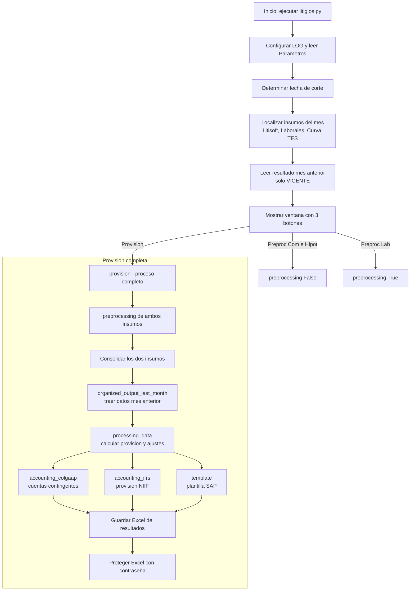

# Documentación funcional y técnica — Provisión de Litigios

> **Propósito de este documento**
> Explicar, de principio a fin y en lenguaje sencillo, cómo funciona el proceso de
> **Provisión de Litigios** (comerciales, hipotecarios y laborales). Está pensado
> para que cualquier persona —incluso sin conocimiento previo del proceso— pueda
> entender **qué hace, por qué lo hace, dónde lo hace y cómo lo hace**.
>
> Se elabora especialmente como material de apoyo para una **prueba de recorrido
> (walkthrough)** de **SOX**, **Auditoría** y **Revisoría Fiscal**.

---

## 0. ¿Qué es una prueba de recorrido y cómo usar este documento?

Una **prueba de recorrido (walkthrough)** consiste en que el auditor sigue una
transacción o un proceso "de punta a punta" para confirmar que:

1. **Entiende el proceso** tal como está diseñado.
2. Los **controles** existen y están **donde se dice que están**.
3. Lo **documentado coincide con lo que realmente ocurre** en la práctica.

En una prueba de recorrido normalmente te van a pedir que muestres:

- **De dónde salen los datos** (insumos / fuentes).
- **Qué transformaciones y cálculos** se aplican.
- **Qué controles** garantizan que la información es correcta, completa y válida.
- **Quién ejecuta** el proceso y **con qué evidencia** queda (logs, resultados).
- **Dónde queda almacenado** el resultado y **cómo se protege**.

Este documento está organizado siguiendo ese mismo orden lógico para que puedas
apoyarte en él durante la reunión. Cada sección responde a esas preguntas.

> **Nota importante sobre el alcance:** Este proyecto contiene únicamente el
> **código fuente** (`litigios.py` y el paquete `Fpack`). Las carpetas
> `Insumos`, `LOG`, `Parametros` y `Resultados` viven **fuera** de este proyecto
> (en el directorio padre) y **no se tiene acceso a ellas desde aquí**. Por eso
> este documento describe cómo el código las usa, pero no su contenido real.

---

## 1. Resumen ejecutivo (en una frase)

El proceso toma los **litigios** en curso del banco (demandas comerciales,
hipotecarias y laborales), calcula **cuánto dinero debe reservar (provisionar)**
la compañía para cubrir el riesgo de perder esos procesos, y genera los
**asientos contables** (bajo COLGAAP e IFRS) más una **plantilla lista para
cargar a SAP**.

En términos simples: **"¿Cuánta plata debemos guardar por si perdemos estas
demandas, y cómo se registra eso en la contabilidad?"**

---

## 2. Conceptos de negocio que necesitas conocer

Antes de mirar el código, conviene entender el vocabulario:

| Concepto | Explicación sencilla |
|---|---|
| **Litigio** | Un proceso legal (demanda) en el que el banco está involucrado. Puede ser **COMERCIAL**, **HIPOTECARIO** o **LABORAL**. |
| **Provisión** | Dinero que la empresa "aparta" contablemente porque es **probable** que tenga que pagar algo en el futuro (por ejemplo, perder una demanda). |
| **Cuantía** | El valor económico en disputa dentro del litigio. |
| **Calificación de contingencia** | Qué tan probable es perder el proceso: `REMOTA`, `EVENTUAL`, `PROBABLE` o `EVENTUAL CON PROVISION`. Solo los **PROBABLE** (y equivalentes) generan provisión. |
| **COLGAAP** | Norma contable local colombiana. Aquí se usa para las **cuentas contingentes** (de orden/memorando). |
| **IFRS / NIIF** | Norma contable internacional. Aquí implica **traer a valor presente** la provisión de largo plazo (descontar por el tiempo). |
| **Valor presente** | Cuánto vale **hoy** un pago que se hará en el futuro, aplicando una tasa de descuento. |
| **Corto plazo (CP) / Largo plazo (LP)** | Si el gasto probable ocurrirá en menos de 360 días (**CP**) o en 360 días o más (**LP**). Solo el **LP** se valora a IFRS (se descuenta). |
| **Curva TES / Tasa de descuento** | Tasa de interés (de títulos TES) que se usa para descontar la provisión de largo plazo a valor presente. |
| **Fecha de corte** | El último día del mes que se está cerrando contablemente. Todo el cálculo se refiere a esa fecha. |
| **Sábana / Consolidado** | El archivo de resultados con todos los litigios y sus cálculos del mes. |
| **Plantilla SAP** | Archivo con el formato exacto que el sistema contable (SAP / transacciones ágiles) necesita para cargar los asientos. |

---

## 3. Estructura del proyecto — ¿qué hay en cada archivo?

```
ProvisionLitigios/
├── litigios.py                     ← Programa principal (todo el proceso)
├── DOCUMENTACION_PROVISION_LITIGIOS.md  ← Este documento
└── Fpack/                          ← Paquete de funciones auxiliares propias
    ├── __init__.py                 ← Marca la carpeta como paquete de Python
    ├── funcionesPD.py              ← Funciones de apoyo EN USO (versión vigente)
    └── funcionesPD v2.py           ← Versión antigua/alterna (NO se usa en el flujo)
```

Y **fuera de este proyecto** (en la carpeta padre, sin acceso desde aquí) el
código espera encontrar:

```
<Carpeta padre>/
├── Insumos/          ← Archivos de entrada (Litisoft, laborales, curva TES)
├── Parametros/       ← Configuración (contabilidad, fecha de corte)
├── Resultados/       ← Salidas del proceso (la "sábana" de provisión)
└── LOG/              ← Registro de ejecución y errores (evidencia)
```

### 3.1 `litigios.py` (el corazón del proceso)

Es el archivo que se ejecuta. Contiene:

- La **importación de librerías**.
- La **configuración inicial** (rutas, logging, lectura de parámetros).
- La **definición de la fecha de corte**.
- El **diccionario de campos** (`dict_fields`) y las **reglas de validación**.
- Todas las **funciones del proceso** (preprocesamiento, cálculo, contabilidad,
  plantilla SAP).
- Una **interfaz gráfica** (ventana con botones) para que el usuario elija qué
  tarea ejecutar.

### 3.2 `Fpack/funcionesPD.py` (funciones auxiliares vigentes)

Contiene utilidades reutilizables:

- `save_df(...)`: guarda un DataFrame como Excel o texto.
- `read_some_files(...)`: lee y consolida varios archivos de una carpeta.
- `inputs_identifying(...)`: verifica qué insumos esperados están presentes.
- `df_to_list(...)`: convierte una columna de un DataFrame en una lista.
- **`searchv(...)`**: es la más importante. Funciona como un **BUSCARV
  (VLOOKUP) de Excel**: busca un valor en una columna y devuelve el valor
  correspondiente de otra columna. Se usa muchísimo para traer números de
  sociedad, cuentas contables, centros de costo, tasas, etc.
- **`protect_excel(...)`**: aplica **protección con contraseña** a los archivos
  Excel de salida (control de integridad de la información).

### 3.3 `Fpack/funcionesPD v2.py` (versión antigua)

Es una versión **más ligera y anterior** de `funcionesPD.py`. **No importa
`openpyxl` ni tiene la función `protect_excel`**. El programa principal importa
`funcionesPD` (la vigente), **no** esta v2. Se conserva probablemente como
respaldo/histórico, pero **no participa en el flujo actual**.

### 3.4 `Fpack/__init__.py`

Archivo (casi vacío) que le indica a Python que la carpeta `Fpack` es un
**paquete**, para poder hacer `from Fpack import funcionesPD`.

---

## 4. Dependencias (librerías) y para qué sirven

En `litigios.py` se importan, entre otras:

| Librería | Para qué se usa |
|---|---|
| `os`, `sys`, `re`, `time` | Manejo de rutas, sistema, expresiones regulares, tiempos. |
| `logging` | Dejar **evidencia** de la ejecución (archivo `Record.log`). |
| `traceback` | Capturar el detalle técnico de un error (`Error.json`). |
| `tkinter` | Crear la **ventana gráfica** con botones y mensajes de error. |
| `numpy` (`np`) | Cálculos numéricos y valores nulos (`NaN`). |
| `pandas` (`pd`) | **Motor principal**: leer Excel, transformar tablas (DataFrames). |
| `unidecode` | Quitar tildes/caracteres especiales al limpiar nombres de columnas. |
| `datetime`, `calendar` | Cálculo de fechas y último día del mes. |
| `numpy_financial` (`npf`) | Función `pv` para **valor presente** (descuento IFRS). |
| `ctypes` | Obtener la resolución del monitor (para dimensionar la ventana). |
| `warnings` | Silenciar advertencias puntuales durante los cálculos. |
| `ImpalaHelper.Impala_Helper` | Utilidad interna (se importa `Helper`; no es central en el flujo actual). |
| `getpass` | Disponible para identificar el usuario (control de trazabilidad). |
| `Fpack.funcionesPD` | Las funciones propias descritas arriba. |

---

## 5. Configuración inicial y parámetros (qué ocurre al arrancar)

Cuando se ejecuta `litigios.py`, **antes** de mostrar cualquier ventana, el
programa hace lo siguiente (parte superior del archivo):

1. **Calcula la ruta del directorio padre** (`path_dir`). Todo (Insumos,
   Parámetros, Resultados, LOG) se busca **un nivel arriba** del proyecto.

2. **Prepara el LOG (evidencia):**
   - Crea la carpeta `LOG` si no existe.
   - Borra un `Error.json` anterior si existía (para no confundir errores viejos
     con nuevos).
   - Configura el `logging` para escribir **a la vez** en el archivo
     `LOG/Record.log` y en la consola. Este `Record.log` es una **evidencia
     clave** para auditoría: registra fecha/hora y cada paso.

3. **Lee los parámetros** desde `Parametros/`:
   - `Contabilidad.xlsx`, que trae **tres hojas**:
     - `SOCIEDADES`: número de sociedad, centros de costo y de beneficio por
       sociedad.
     - `CUENTAS`: el catálogo de cuentas contables por tipo de litigio.
     - `TRANSACCIONES`: los códigos de transacción SAP, monedas, segmentos y
       descripciones.
   - `Fecha corte.xlsx`: define la **fecha de corte** del cierre.

4. **Define el diccionario de campos** (`dict_fields`): la lista maestra de
   **todas las columnas** que tendrá la sábana final y **su tipo de dato**
   (texto, número, fecha, booleano). Es el "contrato" de datos del proceso.

5. **Define los valores válidos** (`valid_values`): para ciertos campos solo se
   aceptan valores de una lista cerrada. Por ejemplo:
   - `LITIGIO` ∈ {COMERCIALES, HIPOTECARIOS, LABORALES}
   - `SOCIEDAD` ∈ {BANCOLOMBIA, BANCA DE INVERSION, FIDUCIARIA, VALORES, NEQUI}
   - `CALIFICACION_CONTINGENCIA` ∈ {REMOTA, EVENTUAL, PROBABLE, EVENTUAL CON PROVISION}
   - etc.
   Esto es un **control de validez de datos**.

### 5.1 Cálculo de la fecha de corte (control importante)

- Si `Fecha corte.xlsx` dice **"Automatico? = si"**, el programa toma el **último
  día del mes anterior** al día en que se ejecuta (si se ejecuta en enero, toma
  diciembre del año anterior).
- Si dice **"no"**, usa la **fecha manual** que esté escrita en el archivo.
- También calcula la **fecha de corte del mes anterior** (`fc_mes_ant`), porque
  el cálculo compara el mes actual contra el mes previo.

> **Punto de control para SOX:** la fecha de corte determina **todo el cierre**.
> El modo (automático/manual) queda registrado en el `Record.log`.

### 5.2 Resolución de los archivos de insumo (`resolve_input_file`)

El programa **no** asume un nombre fijo de archivo. La función
`resolve_input_file(...)` busca el insumo del mes:

1. Primero busca el nombre con periodo `AAAA-MM` (ej. `Litigios_laborales_2026-08.xlsx`).
2. Si no lo encuentra, busca variantes con día `AAAA-MM-DD` del mismo mes.
3. Si hay **varios**, usa el **más reciente** y deja una **advertencia** en el log.
4. Si **no hay ninguno**, lanza un error claro (`FileNotFoundError`) y **detiene**
   el proceso.

Se resuelven tres insumos:

- `Litigios_comerciales_e_hipotecarios` (de la aplicación **Litisoft**).
- `Litigios_laborales`.
- `Curva_TES` (tasas para el descuento a valor presente).

### 5.3 Lectura del resultado del mes anterior

El programa abre la sábana del mes anterior desde
`Resultados/Provision litigios AAAAMMDD.xlsx` y **se queda solo con los procesos
`VIGENTE`**. Ese histórico es la base para comparar mes contra mes.

> **Control de continuidad:** si falta el resultado del mes anterior, el proceso
> no puede continuar. Esto garantiza trazabilidad mes a mes.

---

## 6. Flujo general del proceso (visión de alto nivel)



El usuario ve una **ventana con tres botones**:

1. **"Preproc Com e Hipot"** → solo preprocesa (limpia y valida) el insumo de
   litigios comerciales e hipotecarios.
2. **"Preproc Lab"** → solo preprocesa el insumo de litigios laborales.
3. **"Provision"** → ejecuta **todo el proceso completo** y genera los resultados.

Los dos primeros botones sirven para **revisar la calidad del insumo** antes de
correr el cálculo definitivo (útil para detectar errores de datos temprano).

---

## 7. Explicación paso a paso de cada función

A continuación, cada función del programa explicada en detalle.

### 7.1 `errores(e)` — Manejo centralizado de errores

Cuando **cualquier** parte del proceso falla:

1. Escribe el error en el log.
2. Guarda el detalle técnico completo en `LOG/Error.json`.
3. Muestra una **ventana de error** al usuario.
4. **Detiene** el programa (`sys.exit()`).

> **Control:** ningún error pasa desapercibido; siempre queda **evidencia**
> (`Error.json`) y el proceso no continúa con datos incompletos.

### 7.2 `preprocessing(laborales=True)` — Limpieza y validación de insumos

Esta es una de las funciones más importantes desde el punto de vista de
**controles**. Prepara el insumo (laboral o comercial/hipotecario) así:

**a) Limpieza de nombres de columnas** (`clean_column_names`):
- Pasa todo a MAYÚSCULAS, reemplaza espacios y `/` por `_`, quita tildes y
  guiones dobles. Así los nombres quedan homogéneos y predecibles.

**b) Estandarización de contenido:**
- Convierte a MAYÚSCULAS todos los textos.

**c) Selección y renombrado de campos:**
- Toma solo las columnas necesarias (por posición) y las renombra al estándar
  del proceso.

**d) Reglas específicas para comerciales/hipotecarios** (cuando `laborales=False`):
- Filtra solo las líneas de negocio válidas (`BANCOLOMBIA`, `FACTORING`,
  `LEASING`, `SUFI`, `NEQUI`, `VALORES`, etc.).
- Clasifica el **tipo de litigio**: si la pretensión es "REVISION CONTRATO DE
  MUTUO" → `HIPOTECARIOS`; de lo contrario → `COMERCIALES`.
- Asigna la **SOCIEDAD** según la línea de negocio.
- Normaliza estados `INACTIVO`/`SUSPENDIDO` a `VIGENTE`.
- Calcula **PAGOS_PARCIALES**: si alguno de los cuatro pagos registrados cae
  dentro del mes de corte, toma ese valor.

**e) Número de sociedad y LLAVE:**
- Con `searchv` trae el **número de sociedad** desde el parámetro `SOCIEDADES`.
- Construye la **LLAVE** única de cada litigio:
  `LITIGIO + SOCIEDAD + NUMERO_DE_PROCESO`. Esta llave permite **cruzar** el
  mismo litigio entre meses.

**f) Filtro de registros relevantes:**
- Conserva un registro si es **NUEVO** o si su **LLAVE ya existía** en el mes
  anterior. Así se evita arrastrar procesos que ya no aplican.

**g) CONTROLES DE CALIDAD (clave para auditoría):**
El programa recorre cada campo y valida:
- **Conversión de tipo** (`validar_conversion`): que un número sea número, una
  fecha sea fecha, etc.
- **Valores válidos**: que el valor esté en la lista permitida
  (`valid_values`).
- **Fechas coherentes** (`validar_fecha`): por ejemplo, que la fecha probable
  de gasto sea posterior a la fecha de corte.
- **Centro de costos**: para procesos con provisión, valida que sea un texto de
  10 caracteres que empiece por `C`.
- Cada problema se anota en una columna **`OBSERVACION`** con el detalle
  (`CAMPO ERRADO;` o `CAMPO NULO;`).

**h) Decisión final:**
- Si **NO hay ninguna observación** → el insumo es **correcto**: convierte cada
  campo a su tipo de dato definitivo y continúa.
- Si **hay observaciones** → **guarda un archivo de errores** en `Resultados/`
  (`Preprocesamiento <archivo>.xlsx`) y **detiene** el proceso con el mensaje
  "Preprocesamiento: insumo incorrecto".

> **Este es el principal control de calidad de datos del proceso.** Ningún
> insumo con datos inválidos o incompletos avanza al cálculo. La evidencia del
> problema queda en un Excel específico.

### 7.3 `organized_output_last_month(df)` — Traer el mes anterior

Toma el resultado del mes anterior y trae, para cada litigio (cruzando por
**LLAVE**), los valores que sirven de punto de partida del mes actual, por
ejemplo:
- La cuantía del mes anterior.
- La provisión total anterior.
- La calificación anterior.
- El valor presente anterior.
- Las fechas anteriores.

Rellena con `0` los campos numéricos que no cruzaron (litigios **nuevos** que no
existían el mes pasado).

> **Control de continuidad contable:** garantiza que el cálculo del mes parte
> **exactamente** de donde quedó el mes anterior.

### 7.4 `processing_data(df, tasa)` — El cálculo central de la provisión

Aquí se calcula **toda la lógica financiera**. En orden:

1. **Normaliza calificación:** convierte `EVENTUAL CON PROVISION` a `PROBABLE`
   (y lo **registra en el log**, litigio por litigio, como evidencia).

2. **PROVISION_MES_ACTUAL:** para procesos que ya existían, la provisión del mes
   es la diferencia contra la del mes anterior. Si el proceso está `TERMINADO`,
   la provisión del mes es 0.

3. **Acumulados del año** (`PROVISION_TOTAL_ANO_ACTUAL` y
   `..._ANOS_ANTERIORES`): en enero se "reinicia" el acumulado del año; en los
   demás meses se va sumando.

4. **PROVISION_TOTAL:** provisión del mes anterior + provisión del mes actual.

5. **FECHA_INICIO_LITIGIO:** se ajusta según si el proceso es o sigue siendo
   `PROBABLE`.

6. **CLASIFICACIÓN CP/LP:** compara fecha probable de gasto vs. fecha de inicio.
   Menos de 360 días → `CP`; 360 o más → `LP`.

7. **VALORAR_IFRS:** se marca `True` solo si es **LP** y es (o era) `PROBABLE`.
   Solo esos se descuentan a valor presente.

8. **PROVISION_IFRS_ACTUAL:** para procesos `VIGENTE`, es la provisión total en
   negativo (naturaleza contable del pasivo).

9. **DIAS_A_VALORAR:** días entre la fecha de corte y la fecha probable de gasto.

10. **TASA_DESCUENTO:** con `searchv` sobre la **curva TES**, busca la tasa que
    corresponde a esos días de vencimiento.

11. **VALOR_PRESENTE (actual y con nueva tasa):** usa `npf.pv(...)` para traer a
    **valor presente** la provisión (concepto NIIF/IFRS).

12. **AJUSTE_GASTO_FINANCIERO:** el "costo del tiempo" — cómo cambia el valor
    presente por el paso del tiempo y los pagos parciales.

13. **AJUSTE_PROVISION_NIIF** (`calcular_niif`): compara la valoración del mes
    anterior + gasto financiero contra la actual, considerando pagos parciales y
    si el proceso terminó. Es el **ajuste neto de la provisión bajo NIIF**.

14. **RECUPERACION** (`calcular_recuperacion`): calcula cuánto se **reversa/
    recupera** (ingreso) cuando la provisión disminuye o el proceso termina a
    favor del banco.

15. **SALDO_FINAL:** para procesos vigentes, es el valor presente actual.

16. **AJUSTE_61:** ajuste de las **cuentas contingentes** (COLGAAP): si termina,
    se reversa la cuantía; si sigue, es la variación de cuantía del mes.

17. **Cuentas contables:** con `searchv` sobre el parámetro `CUENTAS`, asigna a
    cada litigio **todas sus cuentas** (contingentes, gasto financiero, gasto
    provisión, ingreso provisión, etc.) según el tipo de litigio.

18. **FECHA_CORTE:** estampa la fecha de corte y ordena todas las columnas según
    `fields`.

> Al terminar, cada litigio tiene **todos sus valores calculados y todas sus
> cuentas asignadas**. Esta es la **sábana** principal (hoja "Provision").

### 7.5 `accounting_colgaap(df1)` — Contabilidad COLGAAP (cuentas contingentes)

- Construye una **plantilla** con todas las combinaciones de cuenta contingente
  × litigio × sociedad.
- **Agrupa y suma** el `AJUSTE_61` por cuenta/litigio/sociedad.
- La cuenta contingente 1 y la 2 se registran con signo opuesto (partida y
  contrapartida).
- Resultado: la **hoja "Contabilidad COLGAAP"** con los totales por cuenta.

### 7.6 `accounting_ifrs(df1)` — Contabilidad IFRS (provisión NIIF)

Igual que la anterior, pero para las cuentas de **IFRS**:
- Provisión gasto financiero (`pgf`) y su contrapartida gasto financiero (`gf`).
- Provisión gasto provisión (`pgp`) y su contrapartida (`gp`).
- Provisión ingreso provisión (`pip`) por recuperaciones y su contrapartida
  (`ip`).
- Agrupa, suma y arma las partidas con sus signos correctos.
- Resultado: la **hoja "Contabilidad IFRS"**.

### 7.7 `template(df1)` — Generación de la plantilla SAP

Convierte los ajustes calculados en **registros con el formato exacto de SAP /
transacciones ágiles**:

1. Recorre cada litigio y, por cada tipo de ajuste distinto de cero
   (`ajuste_61`, `pgf`, `pgp`, `pip`), determina:
   - **Centro de costo** y **centro de beneficio** (desde `SOCIEDADES`; si dice
     "TODOS", los toma del propio litigio).
2. **Totaliza** los ajustes agrupando por tipo/litigio/sociedad/centros.
3. Por cada total, decide **qué cuenta debitar y cuál acreditar** según el signo
   del ajuste (`get_accounts`).
4. Busca en el parámetro `TRANSACCIONES` el **código de transacción**, la
   descripción, la moneda y los segmentos correctos (`generate_register`).
5. Arma cada fila con **fecha documento (hoy)**, **fecha de contabilización
   (fecha de corte)**, **importe en valor absoluto redondeado a 2 decimales**,
   centros, texto, etc.

Resultado: la **hoja "Plantilla SAP"**, lista para cargar al sistema contable.

### 7.8 `InterfazGrafica` — La ventana con botones

Es una clase que dibuja la ventana de Bancolombia con:
- Un mensaje ("¿Qué tarea desea realizar?").
- Botones dinámicos.
- Centrado automático en pantalla.
- Protección al cerrar (pregunta "¿Desea continuar?" para no cerrar por
  accidente).
- Cada botón ejecuta su tarea dentro de un manejo de errores (si algo falla,
  llama a `errores`).

### 7.9 `provision()` — Orquestador del proceso completo

Es lo que corre el botón **"Provision"**. Hace, en orden:

1. Lee la **curva TES** (tasa), saltando encabezados y normalizando a decimal.
2. `preprocessing(False)` → insumo comercial/hipotecario limpio y validado.
3. `preprocessing()` → insumo laboral limpio y validado.
4. **Consolida** ambos insumos en uno solo.
5. `organized_output_last_month(...)` → trae el mes anterior.
6. `processing_data(...)` → calcula toda la provisión.
7. `accounting_colgaap(...)`, `accounting_ifrs(...)`, `template(...)` → generan
   las tres hojas contables.
8. **Guarda** el Excel de resultados con **cuatro hojas**:
   `Provision`, `Contabilidad COLGAAP`, `Contabilidad IFRS`, `Plantilla SAP`.
9. **Protege el Excel con contraseña** (`protect_excel`) → control de integridad.

### 7.10 `main()` y `if __name__ == "__main__"`

- `main()` muestra la ventana con los tres botones y, al final, registra el
  **tiempo de ejecución** en el log.
- `if __name__ == "__main__": main()` es el punto de entrada: solo corre si el
  archivo se ejecuta directamente.
- **Todo** el bloque de funciones está dentro de un `try/except` global: si algo
  se rompe, se atrapa con `errores(e)`.

---

## 8. Insumos, parámetros y salidas (mapa de datos)

### 8.1 Insumos (entradas) — carpeta `Insumos/` (externa)

| Insumo | Origen | Contenido | Cómo lo usa |
|---|---|---|---|
| `Litigios_comerciales_e_hipotecarios_AAAA-MM.xlsx` | Litisoft | Procesos comerciales e hipotecarios | `preprocessing(False)` |
| `Litigios_laborales_AAAA-MM.xlsx` | Área laboral | Procesos laborales | `preprocessing(True)` |
| `Curva_TES_AAAA-MM.xlsx` | Mercado (TES) | Tasas por días de vencimiento | Tasa de descuento IFRS |

### 8.2 Parámetros — carpeta `Parametros/` (externa)

| Archivo / Hoja | Contenido |
|---|---|
| `Contabilidad.xlsx` → `SOCIEDADES` | Número de sociedad, centros de costo y beneficio |
| `Contabilidad.xlsx` → `CUENTAS` | Catálogo de cuentas por tipo de litigio |
| `Contabilidad.xlsx` → `TRANSACCIONES` | Códigos SAP, monedas, segmentos, descripciones |
| `Fecha corte.xlsx` | Modo automático/manual y la fecha de corte |

### 8.3 Salidas — carpeta `Resultados/` (externa)

| Archivo | Contenido |
|---|---|
| `Provision litigios AAAAMMDD.xlsx` | Resultado principal, **4 hojas**: Provision, Contabilidad COLGAAP, Contabilidad IFRS, Plantilla SAP. **Protegido con contraseña.** |
| `Preprocesamiento <insumo>.xlsx` | Solo se genera **si el insumo tiene errores**; contiene la columna `OBSERVACION` con el detalle. |

### 8.4 Evidencia — carpeta `LOG/` (externa)

| Archivo | Contenido |
|---|---|
| `Record.log` | Bitácora completa de la ejecución (se **reescribe** cada corrida). |
| `Error.json` | Detalle técnico del último error (si ocurrió). |

---

## 9. Controles del proceso (guía rápida para SOX / Auditoría / Revisoría)

Esta tabla resume **dónde están los controles**, que es justo lo que suele
verificarse en una prueba de recorrido:

| # | Control | ¿Dónde está en el código? | Evidencia |
|---|---|---|---|
| C1 | **Validación de tipos de dato** (número/fecha/texto) | `preprocessing` → `validar_conversion` | `OBSERVACION` / Excel de preprocesamiento |
| C2 | **Validación de valores permitidos** (listas cerradas) | `preprocessing` + `valid_values` | `OBSERVACION` |
| C3 | **Validación de fechas coherentes** | `preprocessing` → `validar_fecha` | `OBSERVACION` |
| C4 | **Validación de centro de costos** (10 chars, inicia con C) | `preprocessing` | `OBSERVACION` |
| C5 | **Bloqueo si el insumo está vacío o incorrecto** | `preprocessing` (`raise ValueError`) | Proceso se detiene + Excel de errores |
| C6 | **Insumos obligatorios del mes** (si falta, se detiene) | `resolve_input_file` (`FileNotFoundError`) | Log + ventana de error |
| C7 | **Continuidad con el mes anterior** (cruce por LLAVE) | `organized_output_last_month` | Sábana resultante |
| C8 | **Trazabilidad de cambios** (EVENTUAL C/PROV → PROBABLE) | `processing_data` (log por litigio) | `Record.log` |
| C9 | **Manejo centralizado de errores** | `errores(e)` | `Error.json` + `Record.log` |
| C10 | **Protección del resultado con contraseña** | `provision` → `protect_excel` | Excel protegido en `Resultados/` |
| C11 | **Bitácora completa de la ejecución** | Configuración de `logging` | `Record.log` |
| C12 | **Cálculo determinístico basado en parámetros** (cuentas, sociedades, transacciones controladas) | `searchv` sobre `Parametros/` | Parámetros versionados |

### 9.1 Segregación de datos y accesos

- El **código** (este proyecto) está **separado** de los **datos** (Insumos,
  Parámetros, Resultados, LOG), que residen fuera y con acceso restringido.
- La persona que ejecuta el proceso interactúa mediante la **ventana de
  botones**; no manipula el código para correrlo.
- El resultado queda **protegido con contraseña**, evitando alteraciones
  posteriores no autorizadas.

---

## 10. Preguntas frecuentes que pueden hacerte en el recorrido

**¿Cómo se garantiza que no se procesen datos incorrectos?**
Con el bloque de controles de `preprocessing` (C1–C5). Si algo está mal, el
proceso **se detiene** y genera un Excel con el detalle. No hay forma de que un
insumo inválido llegue al cálculo.

**¿Qué pasa si falta un insumo del mes?**
`resolve_input_file` lanza un `FileNotFoundError` con un mensaje claro y el
proceso no continúa (C6).

**¿Cómo se asegura la continuidad mes a mes?**
Cada litigio tiene una **LLAVE** única. El resultado del mes anterior se cruza
por esa llave (C7), de modo que el cálculo parte exactamente del cierre previo.

**¿Cómo se determina cuánto provisionar?**
Solo los litigios **PROBABLE** (y "EVENTUAL CON PROVISION", que se normaliza a
PROBABLE) generan provisión. Los de **largo plazo** se traen a **valor presente**
con la tasa de la curva TES. Toda esa lógica está en `processing_data`.

**¿De dónde salen las cuentas contables y los códigos SAP?**
De los parámetros `CUENTAS` y `TRANSACCIONES` (archivo `Contabilidad.xlsx`),
consultados con `searchv`. El código **no inventa** cuentas; las lee de
parámetros controlados.

**¿Dónde queda la evidencia de la ejecución?**
En `LOG/Record.log` (bitácora) y, si hubo error, en `LOG/Error.json`.

**¿Quién puede modificar los resultados?**
El Excel de resultados se **protege con contraseña** al final del proceso (C10).

**¿Por qué hay dos archivos `funcionesPD`?**
`funcionesPD.py` es la versión vigente (incluye la protección de Excel).
`funcionesPD v2.py` es una versión anterior/respaldo que **no** se usa en el
flujo actual.

---

## 11. Glosario de campos principales de la sábana

| Campo | Significado |
|---|---|
| `LLAVE` | Identificador único del litigio (LITIGIO + SOCIEDAD + Nº proceso) |
| `LITIGIO` | Tipo: COMERCIALES / HIPOTECARIOS / LABORALES |
| `SOCIEDAD` / `NUMERO_SOCIEDAD` | Entidad del grupo y su código |
| `CUANTIA_INICIAL / _MES_ANTERIOR / _ACTUAL` | Valor en disputa en distintos momentos |
| `PROVISION_MES_ACTUAL` | Provisión reconocida en el mes |
| `PROVISION_TOTAL` | Provisión acumulada total del litigio |
| `CALIFICACION_CONTINGENCIA` | REMOTA / EVENTUAL / PROBABLE / EVENTUAL CON PROVISION |
| `PROCESO_NUEVO_EXISTIA` | Si el proceso es NUEVO o ya EXISTIA |
| `PROCESO_VIGENTE_TERMINADO` | Si sigue VIGENTE o ya TERMINADO |
| `CLASIFICACION_CP_LP` | Corto plazo / Largo plazo |
| `VALORAR_IFRS` | Si aplica descuento a valor presente (LP y PROBABLE) |
| `TASA_DESCUENTO` | Tasa (curva TES) usada para descontar |
| `VALOR_PRESENTE_PROVISION_MES_ACTUAL` | Provisión traída a hoy |
| `AJUSTE_GASTO_FINANCIERO` | Efecto del paso del tiempo (NIIF) |
| `AJUSTE_PROVISION_NIIF` | Ajuste neto de la provisión bajo NIIF |
| `RECUPERACION` | Reversos/ingresos por disminución de provisión |
| `AJUSTE_61` | Ajuste de cuentas contingentes (COLGAAP) |
| `CUENTA_*` | Cuentas contables asignadas al litigio |
| `FECHA_CORTE` | Fecha del cierre contable |

---

## 12. Cómo se ejecuta (resumen operativo)

1. Se asegura que existan los **insumos del mes** en `Insumos/` y los
   **parámetros** en `Parametros/`, y el **resultado del mes anterior** en
   `Resultados/`.
2. Se ejecuta `litigios.py`.
3. Aparece la **ventana con tres botones**.
4. (Opcional) Se corre primero **"Preproc Com e Hipot"** y **"Preproc Lab"**
   para validar los insumos.
5. Se presiona **"Provision"** para generar el resultado completo.
6. El resultado queda en `Resultados/Provision litigios AAAAMMDD.xlsx`,
   **protegido con contraseña**, y la evidencia en `LOG/Record.log`.

---

*Documento generado como apoyo para pruebas de recorrido (walkthrough) de SOX,
Auditoría y Revisoría Fiscal. Describe el comportamiento del código contenido en
este proyecto (`litigios.py` y el paquete `Fpack`).*
