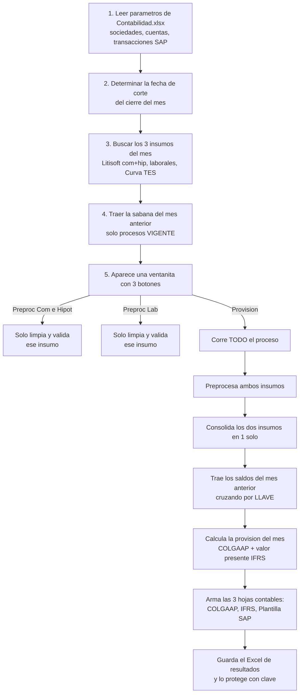

# Guía práctica: Proceso de Provisión de Litigios + Cambio "Sociedad dinámica"

> **Para quién es este documento:** para alguien que acaba de recibir este proyecto,
> no lo construyó, y necesita entender qué hace y cómo funciona antes de modificarlo.
> Está escrito en lenguaje simple, con analogías, evitando tecnicismos sin explicar.
>
> Ya existe en este proyecto un documento más extenso y formal, pensado para
> auditoría/SOX: [`DOCUMENTACION_PROVISION_LITIGIOS.md`](DOCUMENTACION_PROVISION_LITIGIOS.md).
> Esta guía es un complemento más directo, pensado para "aprender a manejar el carro"
> y además documenta el cambio puntual que se hizo (sociedad dinámica) y lo que
> todavía queda pendiente (sociedad de Nequi).

---

## 1. ¿Qué hace este programa, en una frase?

Cada mes, el banco tiene demandas en curso (litigios comerciales, hipotecarios y
laborales). Este programa calcula **cuánta plata hay que apartar (provisionar)**
por si el banco pierde esas demandas, arma **el asiento contable** (bajo norma
local COLGAAP y norma internacional IFRS) y deja **un archivo listo para subir a
SAP**. Todo controlado, con evidencia de ejecución y validación de que los datos
de entrada estén completos y correctos.

En criollo: *"¿cuánto debo guardar por si pierdo estas demandas, y cómo lo registro
contablemente?"*

---

## 2. El flujo de trabajo, como una receta de cocina



Los botones "Preproc..." sirven para revisar la calidad de un insumo **sin** correr
todo el cálculo — útil para pillar errores de datos temprano, antes del cierre real.

---

## 3. Cómo está armado el proyecto (mapa de archivos)

```
Litigios/                              ← este proyecto (el código)
├── litigios.py                        ← TODO el proceso vive aquí (un solo archivo)
├── funcionesPD.py                     ← funciones de apoyo reutilizables (el "kit de herramientas")
├── DOCUMENTACION_PROVISION_LITIGIOS.md← documentación formal para auditoría/SOX
└── GUIA_PROCESO_Y_CAMBIO_SOCIEDAD.md  ← este documento
```

Y **fuera de este proyecto**, un nivel arriba en el disco (`path_dir` en el código),
viven los datos — el código nunca trae datos "quemados", siempre los busca ahí:

```
<carpeta padre>/
├── Insumos/          ← lo que entra: litigios de Litisoft, laborales, curva TES
├── Parametros/        ← la "configuración del negocio": Contabilidad.xlsx y Fecha corte.xlsx
├── Resultados/        ← lo que sale: la sábana final protegida con clave
└── LOG/               ← evidencia de cada corrida (Record.log) y errores (Error.json)
```

**Por qué importa esta separación:** el código (`litigios.py`) es genérico y estable;
lo que cambia mes a mes (insumos) o cuando cambia una regla de negocio (parámetros)
vive en Excel, fuera del código. Justamente el cambio que vamos a hacer es mover
**más** cosas de "adentro del código" hacia "adentro del Excel de parámetros", para
que ajustar el negocio no obligue a tocar código.

---

## 4. ¿De dónde sale cada dato? (mapa rápido)

| Carpeta | Archivo | Qué trae | Para qué |
|---|---|---|---|
| `Insumos/Litigios_comerciales_hip/` | `Litigios_comerciales_e_hipotecarios_AAAA-MM.xlsx` | Demandas comerciales e hipotecarias (viene de la app **Litisoft**) | Base del cálculo comercial/hipotecario |
| `Insumos/Litigios_laborales/` | `Litigios_laborales_AAAA-MM.xlsx` | Demandas laborales | Base del cálculo laboral |
| `Insumos/Curva_TES/` | `Curva_TES_AAAA-MM.xlsx` | Tasas de mercado por plazo | Descontar a valor presente (IFRS) |
| `Parametros/` | `Contabilidad.xlsx` → hoja **SOCIEDADES** | Sociedades del grupo, su número contable, sus centros de costo/beneficio | Saber "a nombre de qué empresa" se contabiliza cada litigio |
| `Parametros/` | `Contabilidad.xlsx` → hoja **CUENTAS** | Cuentas contables por tipo de litigio | Saber qué cuenta usar al contabilizar |
| `Parametros/` | `Contabilidad.xlsx` → hoja **TRANSACCIONES** | Códigos de transacción SAP, monedas, segmentos | Armar la plantilla SAP con el formato exacto |
| `Parametros/` | `Fecha corte.xlsx` | La fecha de cierre del mes (automática o manual) | Define "a qué mes le estamos calculando" |
| `Resultados/` | `Provision litigios AAAAMMDD.xlsx` (mes anterior) | Sábana del cierre anterior | Punto de partida del mes actual |

---

## 5. Conceptos que necesitas tener claros antes de tocar código

- **LLAVE**: el identificador único de cada litigio = `LITIGIO + SOCIEDAD + NUMERO_DE_PROCESO`
  (ej: `COMERCIALESNEQUI123456`). Con esto el programa "reconoce" al mismo litigio
  mes tras mes, sin importar qué más haya cambiado. **Importante para el cambio que
  viene:** la LLAVE usa el *nombre* de la sociedad (texto), no el número contable.

- **SOCIEDAD (texto) vs. NUMERO_SOCIEDAD (número)**: son dos cosas distintas.
  - `SOCIEDAD` es una etiqueta legible ("NEQUI", "BANCOLOMBIA", "VALORES"...).
  - `NUMERO_SOCIEDAD` es el código contable con el que se contabiliza en SAP
    (ej. 1000, 4700...).
  - El programa primero decide la etiqueta (`SOCIEDAD`), y **después** busca el
    número que le corresponde en el parámetro `SOCIEDADES`. El número **nunca**
    está escrito en el código — siempre sale del Excel.

- **`searchv(...)` = un BUSCARV de Excel en Python**: función en `funcionesPD.py`
  que busca un valor en una columna de un parámetro y trae el valor de otra columna
  de esa misma fila. Se usa por todo el código para traer números de sociedad,
  cuentas contables, tasas, códigos de transacción, etc. **El código no "inventa"
  nada de esto, siempre lo consulta en el Excel de parámetros.**

- **Los controles de calidad (`valid_values`)**: para ciertos campos (como
  `SOCIEDAD`, `LITIGIO`, `CALIFICACION_CONTINGENCIA`...) solo se aceptan valores
  de una lista cerrada. Si un registro trae un valor que no está en esa lista, se
  marca como `CAMPO ERRADO` en una columna `OBSERVACION`, y **el proceso completo
  se detiene** (no se calcula nada) hasta que se corrija el insumo. Esto es justo
  lo que se modificó para `SOCIEDAD` (ver sección 7): antes esa lista estaba
  escrita a mano en el código (Python); ahora se lee directamente del Excel.

- **Fecha de corte**: el último día del mes que se está cerrando. Puede ser
  automática (toma el mes anterior al día de hoy) o manual (la que se escriba en
  `Fecha corte.xlsx`). Todo el cálculo gira en torno a esta fecha.

---

## 6. Mapa rápido del código (para orientarte en `litigios.py`)

| Qué hace | Función / bloque | Línea aprox. |
|---|---|---|
| Carga parámetros (`SOCIEDADES`, `CUENTAS`, `TRANSACCIONES`, fecha de corte) | inicio del script | [litigios.py:46-54](litigios.py#L46-L54) |
| Diccionario maestro de campos de la sábana | `dict_fields` | [litigios.py:57-107](litigios.py#L57-L107) |
| Lista de valores válidos por campo (`SOCIEDAD` ya se lee de `Contabilidad.xlsx`, ver sección 7) | `valid_values` | [litigios.py:111-117](litigios.py#L111-L117) |
| Limpia y valida el insumo del mes (comercial/hipotecario o laboral) | `preprocessing(laborales)` | [litigios.py:187-369](litigios.py#L187-L369) |
| **Traduce `LINEA_DE_NEGOCIO` (Litisoft) a la etiqueta SOCIEDAD — esto SÍ sigue quemado en código, ver sección 8** | dentro de `preprocessing` | [litigios.py:279](litigios.py#L279), [litigios.py:289-295](litigios.py#L289-L295) |
| Busca el NUMERO_SOCIEDAD de cada etiqueta en el parámetro | dentro de `preprocessing` | [litigios.py:312-317](litigios.py#L312-L317) |
| Trae los saldos del mes anterior cruzando por LLAVE | `organized_output_last_month` | [litigios.py:371-408](litigios.py#L371-L408) |
| Calcula toda la provisión (COLGAAP + IFRS) | `processing_data` | [litigios.py:410-583](litigios.py#L410-L583) |
| Arma la hoja de contabilidad COLGAAP | `accounting_colgaap` | [litigios.py:585-619](litigios.py#L585-L619) |
| Arma la hoja de contabilidad IFRS | `accounting_ifrs` | [litigios.py:621-684](litigios.py#L621-L684) |
| Arma la plantilla SAP (usa `TRANSACCIONES` filtrando por `NUMERO_SOCIEDAD`) | `template` | [litigios.py:686-819](litigios.py#L686-L819) |
| Orquesta todo el proceso completo (botón "Provision") | `provision` | [litigios.py:895-922](litigios.py#L895-L922) |
| Ventana gráfica de botones | `InterfazGrafica` | [litigios.py:821-893](litigios.py#L821-L893) |

---

## 7. Cambio aplicado: SOCIEDAD ya no "quemada" en el código

> **Estado: ✅ Aplicado el 2026-09-15.** El código de `litigios.py` ya quedó
> modificado. Falta que lo pruebes en el PC de la empresa (ver 7.5) antes de
> confiar en él para un cierre real.

### 7.1 Qué había antes

En [litigios.py:113](litigios.py#L113):

```python
fields[2]: ['BANCOLOMBIA', 'BANCA DE INVERSION', 'FIDUCIARIA', 'VALORES', 'NEQUI'], # SOCIEDAD
```

Esta lista fija era el **único** lugar donde se decidía qué valores de `SOCIEDAD`
eran aceptables al validar los insumos. Si el banco creaba una sociedad nueva, había
que **editar el código** y volver a desplegarlo para que el proceso la reconociera.

### 7.2 Qué se cambió

Ahora la línea 113 lee la columna `SOCIEDAD` de la hoja `SOCIEDADES` del parámetro
`Contabilidad.xlsx` (el DataFrame `sociedades`, que el código ya carga al inicio en
[litigios.py:49](litigios.py#L49), **antes** de que se defina `valid_values`):

```python
# Antes
fields[2]: ['BANCOLOMBIA', 'BANCA DE INVERSION', 'FIDUCIARIA', 'VALORES', 'NEQUI'],

# Después (ya aplicado)
fields[2]: sociedades['SOCIEDAD'].dropna().unique().tolist(),
```

### 7.3 Qué conlleva este cambio (impacto)

- **No cambia ningún resultado de hoy**: si la hoja `SOCIEDADES` tiene hoy
  exactamente esas 5 sociedades (sin filas vacías ni repetidas), la lista dinámica
  produce el mismo resultado que la lista fija. Es un cambio "hacia adelante".
- **Lo que sí gana:** agregar o quitar una sociedad del control de validación pasa
  a ser una tarea de **editar un Excel**, no de modificar y desplegar código.
- **Lo que NO cambia:** el mapeo que decide *qué etiqueta* de `SOCIEDAD` le
  corresponde a cada `LINEA_DE_NEGOCIO` de Litisoft ([litigios.py:289-295](litigios.py#L289-L295))
  sigue siendo una regla escrita en el código. Es decir: agregar una sociedad
  nueva en el Excel hace que el control la **acepte** como válida, pero **no**
  hace que el código sepa asignarla automáticamente a ningún litigio — eso seguiría
  necesitando un ajuste de código aparte, si llegara a hacer falta.
- **Dónde vive ahora el control (relevante para auditoría/SOX):** el
  `DOCUMENTACION_PROVISION_LITIGIOS.md` describe el control C2 (valores permitidos)
  como algo definido en el código. Tras el cambio, la lista maestra vive en
  `Parametros/Contabilidad.xlsx → SOCIEDADES → SOCIEDAD`; conviene actualizar esa
  nota de control para que el walkthrough siga siendo fiel a la realidad.
- **Importante — esto NO resuelve el tema de Nequi (sección 9):** este cambio
  solo decide qué *etiquetas de texto* de `SOCIEDAD` son válidas (`"NEQUI"`,
  `"BANCOLOMBIA"`...). Nunca toca ni valida el `NUMERO_SOCIEDAD` (1000, 4700...).
  Son dos tareas **independientes**: esta ya quedó aplicada en el código; la de
  Nequi sigue pendiente y se resuelve editando `Contabilidad.xlsx`, no con código.

### 7.4 Qué debes preparar en `Contabilidad.xlsx` antes de probar

La hoja `SOCIEDADES` ya existe y ya se usa hoy (para buscar el `NUMERO_SOCIEDAD`),
así que **no es una hoja nueva**. Antes de probar el cambio, revisa que cumpla:

- [ ] La columna se llama exactamente **`SOCIEDAD`** (mayúsculas, sin espacios raros).
- [ ] Cada sociedad aparece en **mayúsculas** y sin espacios al inicio/final (el
      programa pasa todo el texto de los insumos a mayúsculas antes de comparar,
      así que si el parámetro no está en mayúsculas, nunca va a "calzar").
- [ ] **No hay valores repetidos** en `SOCIEDAD` (dos filas con "NEQUI", por
      ejemplo) — si los hay, el `searchv` que busca el `NUMERO_SOCIEDAD` puede
      traer la fila equivocada.
- [ ] **No hay filas en blanco** ni filas de relleno/total al final de la hoja
      (se descartan con `dropna()`, pero mejor limpiarlas para que la hoja quede clara).
- [ ] Cada sociedad tiene su `NUMERO_SOCIEDAD` y sus columnas de centro de costo y
      centro de beneficio por tipo de litigio (`COMERCIALES_CENTRO_COSTO`,
      `HIPOTECARIOS_CENTRO_COSTO`, `LABORALES_CENTRO_COSTO` y sus equivalentes
      `_CENTRO_BENEFICIO`), porque esas mismas filas las sigue usando el resto del
      proceso (no solo el control nuevo).

### 7.5 Cómo probar el cambio

Como no se puede ejecutar desde este entorno, el plan de pruebas es para correrlo
tú en el PC de la empresa, idealmente con una **copia de prueba** de `Contabilidad.xlsx`
(no el archivo real de producción) hasta confirmar que todo se comporta bien:

1. **Prueba de regresión (que nada se rompa):**
   Corre `Preproc Com e Hipot` y `Preproc Lab` con un insumo de un mes ya conocido
   (uno que ya hayas corrido antes con el código viejo). Compara la columna
   `OBSERVACION` resultado contra lo que obtenías antes del cambio: debe salir
   **exactamente igual** (los mismos registros marcados como erróneos, ni más ni
   menos). Esto confirma que la lista dinámica hoy es equivalente a la lista fija.

2. **Prueba de detección de error (que el control siga funcionando):**
   Mete a propósito, en una copia del insumo, un registro con un valor de
   `SOCIEDAD` que no exista en absoluto (ej. un typo: "BANCOLOMBIAA"). Corre el
   preprocesamiento y confirma que ese registro sigue quedando marcado
   `SOCIEDAD ERRADO` en `OBSERVACION`.

3. **Prueba de sociedad nueva (el objetivo del cambio):**
   En tu copia de prueba de `Contabilidad.xlsx`, agrega una fila nueva en
   `SOCIEDADES` con una sociedad ficticia (ej. "PRUEBA") con todos sus datos
   completos. En una copia del insumo, pon un registro con `SOCIEDAD = "PRUEBA"`.
   Corre el preprocesamiento y confirma que **ya no** se marca como error de
   `SOCIEDAD` (antes sí se hubiera marcado, porque "PRUEBA" no estaba en la lista
   fija del código). *(Nota: como se explica en 7.3, esto solo prueba el control;
   nunca vas a ver una `SOCIEDAD = "PRUEBA"` real porque nada del código la asigna
   automáticamente — para eso haría falta tocar el mapeo de línea de negocio.)*
   Al terminar la prueba, quita esa fila de prueba de la copia para no dejar basura.

4. **Prueba de punta a punta:**
   Corre el botón `Provision` completo con un mes de prueba y confirma que las 4
   hojas de resultado se generan sin error (`Provision`, `Contabilidad COLGAAP`,
   `Contabilidad IFRS`, `Plantilla SAP`) y que el archivo queda protegido con
   clave como siempre.

### 7.6 Criterios de aceptación (checklist final)

- [ ] La lista de sociedades válidas para el control coincide exactamente con lo
      que hay en `Contabilidad.xlsx → SOCIEDADES → SOCIEDAD`, sin tocar código.
- [ ] Un mes ya cerrado, vuelto a correr con el código nuevo, produce **los mismos
      resultados** que con el código viejo (mismas observaciones, mismos números).
- [ ] Un valor de `SOCIEDAD` que no exista en el parámetro sigue siendo detectado
      como `CAMPO ERRADO`.
- [ ] Una sociedad agregada solo en el Excel (sin tocar `litigios.py`) es aceptada
      por el control de validación.
- [ ] El `Record.log` sigue mostrando `Preprocesamiento: insumo correcto` para un
      insumo bueno, y el proceso completo (`Provision`) corre de principio a fin
      sin errores.

---

## 8. Un punto relacionado que NO se tocó: `LINEA_DE_NEGOCIO`

Antes de asignar la etiqueta `SOCIEDAD`, el código tiene que decidir a qué
etiqueta traducir cada litigio. Ese dato de entrada se llama `LINEA_DE_NEGOCIO` y
**viene ya armado desde Litisoft** (el sistema del área jurídica) — no lo inventa
`litigios.py`. Es la forma en que Litisoft clasifica cada caso: valores como
`BANCOLOMBIA`, `FACTORING`, `FONDO INMOBILIARIO`, `LEASING`, `SUFI`,
`TITULARIZADORA`, `NEQUI`, `VALORES`, `BANCA DE INVERSION`, `FIDUCIARIA`.

El código traduce ese valor crudo a la etiqueta `SOCIEDAD` con una tabla de
equivalencias escrita a mano en [litigios.py:279](litigios.py#L279) y
[litigios.py:289-295](litigios.py#L289-L295):

| `LINEA_DE_NEGOCIO` (viene de Litisoft) | se traduce a `SOCIEDAD` |
|---|---|
| BANCOLOMBIA, FACTORING, FONDO INMOBILIARIO, LEASING, SUFI, TITULARIZADORA | **BANCOLOMBIA** (6 líneas distintas caen en la misma sociedad) |
| BANCA DE INVERSION | BANCA DE INVERSION |
| FIDUCIARIA | FIDUCIARIA |
| VALORES | VALORES |
| NEQUI | NEQUI |

### 8.1 ¿Está quemado en el código o en algún Excel?

**Está quemado en el código**, no en ningún parámetro de `Contabilidad.xlsx` ni
en ningún otro Excel de `Parametros/` — se confirmó con búsqueda de texto que
esta tabla solo existe en `litigios.py`. A diferencia del `NUMERO_SOCIEDAD`, que
siempre vivió en el Excel, esta tabla sí obligaría a **editar y desplegar código**
si algún día hay que agregar o reclasificar una línea de negocio.

### 8.2 ¿Afecta lo que hicimos en la sección 7, o lo de Nequi (sección 9)?

No, es un bloque **independiente** de ambos:

- El control de valores válidos (sección 7) sigue produciendo exactamente las
  mismas 5 etiquetas de siempre, así que no hay ningún choque con esta tabla.
- El cambio de Nequi (sección 9) solo cambia a qué *número* se traduce la
  etiqueta `"NEQUI"` — esta tabla sigue diciendo "si `LINEA_DE_NEGOCIO` es NEQUI,
  la sociedad es NEQUI" sin importar a qué número se traduzca después.

### 8.3 Cuándo sí importaría (para tenerlo en el radar, no para actuar ahora)

Solo sería un problema si Litisoft empieza a mandar un valor de `LINEA_DE_NEGOCIO`
nuevo que no esté en la lista `line_comer` ([litigios.py:279](litigios.py#L279)).
Y hay un detalle importante: a diferencia del control de `SOCIEDAD` (que marca
`CAMPO ERRADO` y avisa), este filtro en [litigios.py:282](litigios.py#L282)
descarta el registro **en silencio** — no marca error, no detiene el proceso,
simplemente ese litigio nunca entra al cálculo. No lo pediste y no bloquea nada
de lo que hicimos, pero es un punto ciego que conviene conocer.

---

## 9. Nota aparte: Nequi pasa de sociedad 1000 a 4700 desde septiembre

Este es un cambio **distinto** al de la sección 7, y **no requiere tocar
`litigios.py`** — es puramente de datos/parámetros, porque el código nunca tiene
escrito "1000" ni "4700" en ningún lado (se confirmó revisando el archivo).

Hoy, cuando un litigio viene de Litisoft con `LINEA_DE_NEGOCIO = NEQUI`, el código
le pone la etiqueta `SOCIEDAD = "NEQUI"` (sección 8) y luego busca su
`NUMERO_SOCIEDAD` en la hoja `SOCIEDADES` — ese número (1000 hoy) sale de esa
hoja, no del código.

### 9.1 Qué debes preparar en `Contabilidad.xlsx` antes de septiembre

- [ ] **`SOCIEDADES`**: en la fila de `SOCIEDAD = "NEQUI"`, cambiar
      `NUMERO_SOCIEDAD` de 1000 a 4700, y revisar que las columnas de centro de
      costo/beneficio de esa fila (por `COMERCIALES`, `HIPOTECARIOS`, `LABORALES`)
      correspondan realmente a la sociedad 4700 (hoy probablemente traen las de
      Bancolombia, porque venían contabilizándose ahí).
- [ ] **`TRANSACCIONES`**: agregar las filas necesarias para `NUMERO_SOCIEDAD = 4700`
      (una por cada combinación de tipo de litigio + cuenta a debitar/acreditar que
      Nequi pueda generar). **Si falta alguna, el proceso se cae con un error** al
      armar la Plantilla SAP el primer mes que un litigio de Nequi tenga un ajuste
      distinto de cero — así que hay que parametrizarlas todas antes de correr el
      cierre real de septiembre, no después.
- [ ] **`CUENTAS`**: no requiere cambios (esa hoja se consulta solo por tipo de
      litigio, no por sociedad).

### 9.2 Cómo probarlo

Igual que en 7.5: usa una copia de prueba, mete un registro ficticio de Nequi con
algún ajuste distinto de cero, y corre `Provision` completo para confirmar que la
Plantilla SAP encuentra la transacción correcta para sociedad 4700 sin caerse.
Una vez confirmado, aplica los mismos cambios en el archivo real antes del cierre
de septiembre.

**Dato tranquilizador:** como la `LLAVE` de cada litigio usa la etiqueta "NEQUI"
(texto) y no el número de sociedad, el cambio de 1000 a 4700 **no rompe** el cruce
con la provisión de agosto — el programa va a seguir reconociendo esos litigios
como los mismos de siempre, solo que ahora contabilizados bajo otra sociedad.

### 9.3 ¿El cambio de código de la sección 7 resuelve esto? No — resumen

Son dos tareas que **no dependen una de la otra**. Para que quede clarísimo:

| Pedido | ¿Cómo se resuelve? | ¿Estado |
|---|---|---|
| Sociedades ya no quemadas en el control de validación | Cambio de código en `litigios.py` (sección 7) | ✅ Aplicado |
| Nequi debe contabilizar en 4700 desde septiembre | Edición manual de `Contabilidad.xlsx` (`SOCIEDADES` + `TRANSACCIONES`) | ⏳ Pendiente, la haces tú |

---

## 10. Glosario rápido

| Término | Significado |
|---|---|
| Sábana | El Excel de resultados con todos los litigios y sus cálculos del mes |
| Provisión | Plata que se aparta contablemente por ser probable que se pierda una demanda |
| COLGAAP | Norma contable local (aquí, cuentas contingentes/de memorando) |
| IFRS / NIIF | Norma contable internacional (aquí, valor presente de la provisión de largo plazo) |
| Valor presente | Cuánto vale hoy un pago que se hará en el futuro |
| CP / LP | Corto plazo (< 360 días) / Largo plazo (≥ 360 días) |
| LLAVE | Identificador único de un litigio: LITIGIO + SOCIEDAD + Nº proceso |
| searchv | Función propia que actúa como un BUSCARV de Excel dentro de Python |
| OBSERVACION | Columna donde se anota por qué un registro quedó marcado como error |

---

## 11. Preguntas que probablemente te vas a hacer

**¿Dónde corro esto?**
Ejecutando `litigios.py`. Aparece una ventanita de Bancolombia con 3 botones.

**¿Qué pasa si algo sale mal?**
El proceso se detiene, queda registrado en `LOG/Record.log` y el detalle técnico en
`LOG/Error.json`, y aparece una ventana de error. No sigue de largo con datos malos.

**¿Puedo perder información si pruebo el cambio?**
No, si trabajas sobre copias del insumo y del `Contabilidad.xlsx`. El proceso real
solo lee de `Insumos/` y `Parametros/`, y solo escribe en `Resultados/` y `LOG/` —
nunca modifica tus archivos de entrada.

**¿Por qué el número de sociedad no está en el código?**
A propósito: todo lo que puede cambiar por decisión de negocio (sociedades,
cuentas, transacciones SAP) se dejó en Excel desde el diseño original, para no
tener que tocar código cada vez. El punto que sí quedó "quemado" fue la lista de
*validación* de sociedades (sección 7, ya corregido) y el mapeo
`LINEA_DE_NEGOCIO → SOCIEDAD` (sección 8, que se dejó igual a propósito).

**¿Entonces ya quedó todo listo para septiembre?**
No todavía. El cambio de código (sección 7) ya está aplicado, pero falta que tú
actualices `Contabilidad.xlsx` para el tema de Nequi (sección 9) y que se pruebe
todo en el PC de la empresa antes de confiar en el cierre real.
